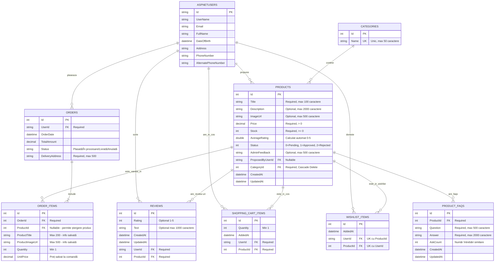

# ShopKeep

# Baza de Date - Structura Actualizată

## Diagrama Entitate-Relație (ERD)

## Descriere Tabele

### AspNetUsers (Identity Framework)
Tabelă gestionată de ASP.NET Core Identity pentru autentificare și autorizare.
- **Roluri**: Admin, Editor, User
- Super Admin: `admin@shopkeep.com` (protejat împotriva modificărilor)

### Categories
Categorii de produse pentru organizare și filtrare.
- **Constrangeri**: Nume unic, validare lungime 2-50 caractere
- **Cascade Delete**: Ștergerea categoriei șterge și produsele asociate

### Products
Produse propuse de utilizatori sau adăugate de admin/editori.
- **Status**:
  - `0 = Pending` - În așteptare aprobare
  - `1 = Approved` - Aprobat, vizibil pentru utilizatori
  - `2 = Rejected` - Respins de admin
- **Average Rating**: Calculat automat din reviews
- **Cascade**: Ștergerea produsului păstrează OrderItems (ProductId = null, info salvată)

### Reviews
Review-uri și rating-uri pentru produse.
- **Rating**: Opțional, 1-5 stele
- **Text**: Opțional, maxim 1000 caractere
- **Unicitate**: Un utilizator poate avea maxim un review per produs

### ShoppingCartItems
Coș de cumpărături pentru utilizatori autentificați.
- **Validare**: Cantitate minimă 1, verificare stoc disponibil
- **Subtotal**: Proprietate calculată (Price × Quantity)

### WishlistItems
Lista de dorințe (favorite) pentru utilizatori autentificați.
- **Constrangere**: Combinație unică UserId-ProductId

### Orders
Comenzi plasate de utilizatori.
- **Status**: "Plasată", "În procesare", "Livrată", "Anulată"
- **Anulare**: Doar pentru comenzi cu status "Plasată", restaurează stocul

### OrderItems
Produse incluse într-o comandă.
- **Info Salvată**: Title și ImageUrl păstrate chiar dacă produsul e șters
- **ProductId Nullable**: Permite ștergerea produsului fără a afecta istoricul comenzilor
- **UnitPrice**: Prețul salvat la momentul comenzii (nu se actualizează dacă prețul produsului se schimbă)

### ProductFAQs (Nou - Asistent AI)
FAQ-uri generate automat pentru produse bazat pe întrebările utilizatorilor.
- **AskCount**: Contor pentru popularitatea întrebării
- **Auto-generare**: Sistemul AI salvează întrebări frecvente cu răspunsuri
- **Similaritate**: Algoritm Jaccard pentru matching întrebări (prag 70%)

## Migrări Database

### Migrări Importante
1. `InitialMigration` - Structură inițială
2. `CompleteShopKeepModels` - Modele complete
3. `CascadeDeleteCategoryProducts` - Cascade delete pentru categorii
4. `MakeProductIdNullableInOrderItems` - ProductId nullable în OrderItems
5. `PreserveProductInfoInOrderItems` - Adăugare ProductTitle și ProductImageUrl

## Seed Data

### Utilizatori Inițiali
- **Admin**: `admin@shopkeep.com` / `Admin123!`
- **Editor**: `editor@shopkeep.com` / `Editor123!`
- **User**: `user@shopkeep.com` / `User123!`

### Date Inițiale
- 5 categorii predefinite
- 10 produse de test
- Review-uri și rating-uri pentru demonstrație
