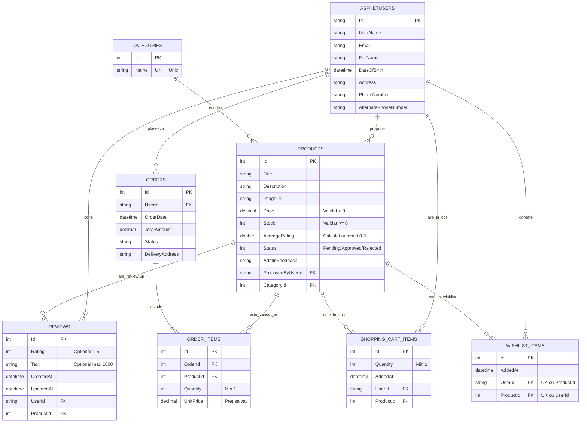

# ShopKeep

# Baza de date(ERD-initiala):

## Structura Bazei de Date

```mermaid
erDiagram
    ASPNETUSERS ||--o{ ORDERS : "plaseaza"
    ASPNETUSERS ||--o{ PRODUCTS : "propune"
    ASPNETUSERS ||--o{ REVIEWS : "scrie"
    ASPNETUSERS ||--o{ SHOPPING_CART_ITEMS : "are_in_cos"
    ASPNETUSERS ||--o{ WISHLIST_ITEMS : "doreste"
    
    CATEGORIES ||--o{ PRODUCTS : "contine"
    
    PRODUCTS ||--o{ REVIEWS : "are_review-uri"
    PRODUCTS ||--o{ SHOPPING_CART_ITEMS : "este_in_cos"
    PRODUCTS ||--o{ WISHLIST_ITEMS : "este_in_wishlist"
    PRODUCTS ||--o{ ORDER_ITEMS : "este_vandut_in"
    
    ORDERS ||--|{ ORDER_ITEMS : "include"

    ASPNETUSERS {
        string Id PK
        string UserName
        string Email
        string FullName
        datetime DateOfBirth
        string Address
        string PhoneNumber
        string AlternatePhoneNumber
    }

    CATEGORIES {
        int Id PK
        string Name UK "Unic"
    }

    PRODUCTS {
        int Id PK
        string Title
        string Description
        string ImageUrl
        decimal Price "Validat > 0"
        int Stock "Validat >= 0"
        double AverageRating "Calculat automat 0-5"
        int Status "Pending/Approved/Rejected"
        string AdminFeedback
        string ProposedByUserId FK
        int CategoryId FK
    }

    REVIEWS {
        int Id PK
        int Rating "Optional 1-5"
        string Text "Optional max 1000"
        datetime CreatedAt
        datetime UpdatedAt
        string UserId FK
        int ProductId FK
    }

    SHOPPING_CART_ITEMS {
        int Id PK
        int Quantity "Min 1"
        datetime AddedAt
        string UserId FK
        int ProductId FK
    }

    WISHLIST_ITEMS {
        int Id PK
        datetime AddedAt
        string UserId FK "UK cu ProductId"
        int ProductId FK "UK cu UserId"
    }

    ORDERS {
        int Id PK
        string UserId FK
        datetime OrderDate
        decimal TotalAmount
        string Status
        string DeliveryAddress
    }

    ORDER_ITEMS {
        int Id PK
        int OrderId FK
        int ProductId FK
        int Quantity "Min 1"
        decimal UnitPrice "Preț salvat"
    }
```
